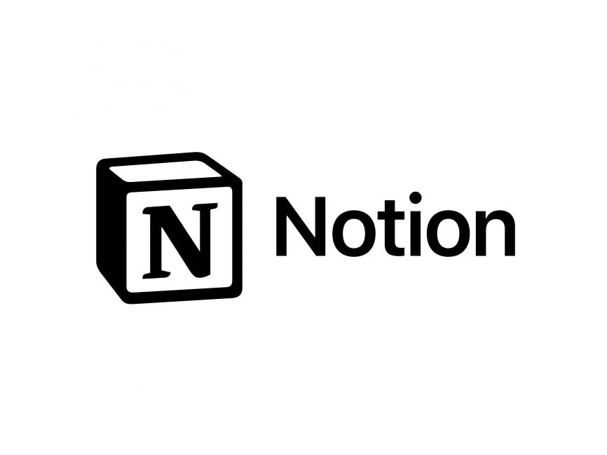
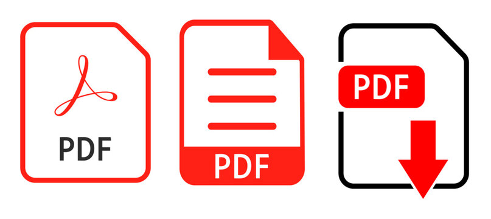

# PDF-to-Notion

  

  

## 前提条件

1. pythonのインストール(pip のインストール)
2. popplerのインストール
[For Windows](https://blog.alivate.com.au/poppler-windows/)  or  
 [For Mac](https://formulae.brew.sh/formula/poppler)
3. pdf_to_image.pyのpdf_fileディレクトリとimage_fileディレクトリの絶対パスをそれぞれの環境用に書き換える。

## 使い方

### 1.pdf_fileディレクトリに画像化したいPDFを置く。

### 2. pipenvのインストール

```:bash
pip install pipenv
```

pipenvをインストールした後、

```:bash
cd PDF_TO_NOTION
```

を実行し、
PDF＿TO＿NOTIONディレクトリで

```:bash
pipenv install
```

を実行する。

### 3. 仮想環境の有効化

```:bash
pipenv shell
```

を実行する。

```:bash
pipenv install pdf2image
```

## 各種コマンド

### PDFの画像化

```:bash
pipenv run pdf_to_image
```

PDFから画像化されると、image_fileディレクトリに保存される。

### パスワード付きPDFの画像化

```:bash
pipenv run pdf_to_image_pass
```

PPpdf_to_image_divided

### 3×2分割にしたのPDFの画像化

```:bash
pipenv run pdf_to_image_divided
```

## Notionインテグレーションについて

(https://www.notion.so/ja-jp/help/create-integrations-with-the-notion-api)

## 画像のurl化(未実装：2023/04/03時点)

まず、google driveに画像をアップロードする。
[Google API の利用登録](https://console.developers.google.com/projectselector2/apis/dashboard?supportedpurview=project)

1. まず、プロジェクトを作成する。（学校のアカウントでは権限がないため、個人のgoogleアカウントでログインする。）
2. Google Drive APIの有効化
3. OAuth同意画面の設定をする。
4. 認証情報から、認証情報を作成をクリックし、OAuthクライアントIDの作成
5. 作成後、左下のJSONをダウンロードする。

参照：https://blog.serverworks.co.jp/2021/01/08/130956


+ Notion APIでは画像をバイナリでアップロードすることができないため、一度urlに変換してアップロードする必要がある。
→Amazon S3などの利用を検討しないといけない。

## 生成された画像の削除

```:bash
pipenv run delete_images
```

## ウェブアプリケーションのデプロイ

```:bash
pipenv run deploy_web
```

これを行って、ブラウザのアドレスバーに127.0.0.1:5000を入力するとアクセスが可能になる。
